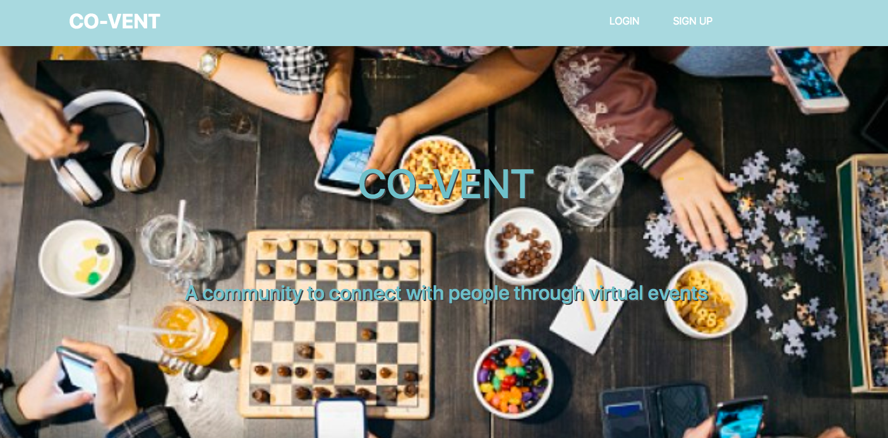
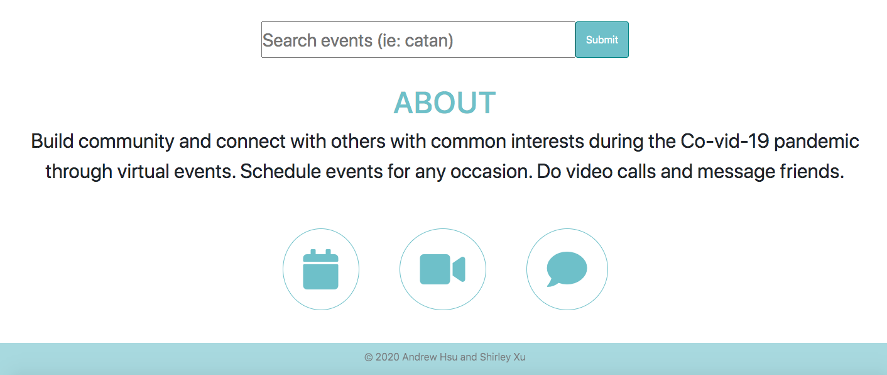
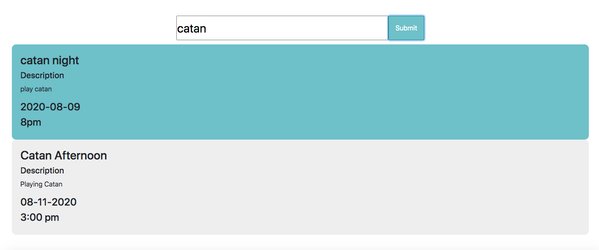
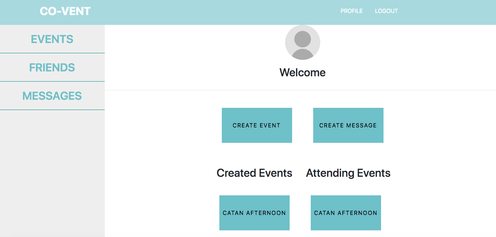
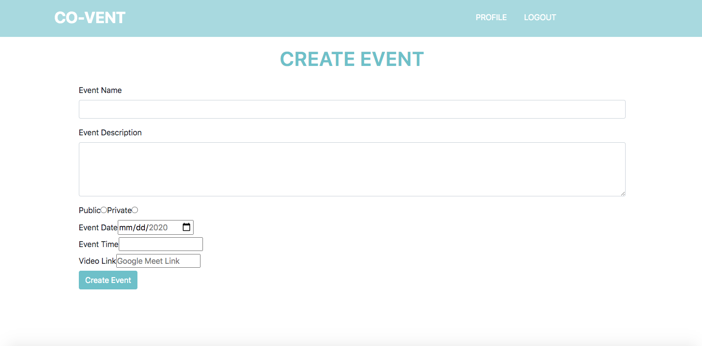
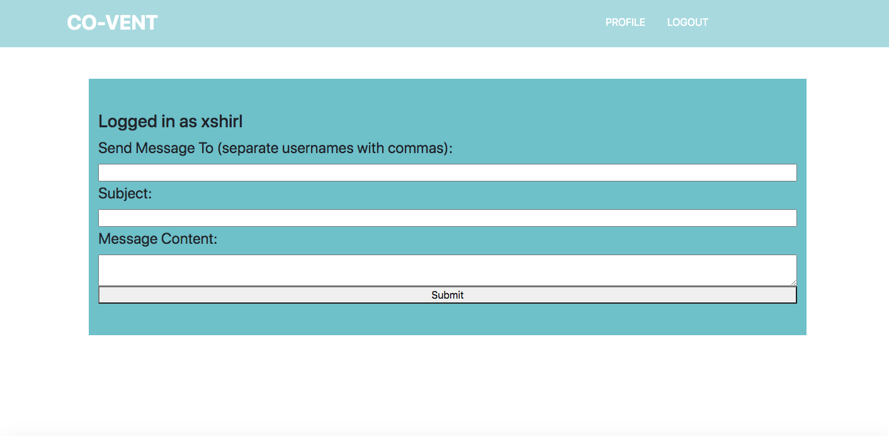

# CO-VENT: Addressing connectivity during Co-vid 19 pandemic



## About

During this time of quarantine, without a means of physically being able to see and talk to their friends and family, many people are resorting to more creative ways of connecting to their peers to prevent feelings of loneliness and isolation. People host game nights, online workshops, virtual work out sessions, paint nights, Bible study fellowships, and etc through Zoom and Google Meet video calls. Scheduling these virtual events is often messy as it relies on multiple social platforms such as Groupme, Facebook, Slack, and email just to simply communicate a video call link and event details to arrange the event.

What if there was a platform that streamlines event planning and helps organize the event for you? What if it could help you make friends with common interests and bond during virtual events?

Co-vent is a social networking platform that brings people with common interests together and organizes virtual events for people and their friends to attend. Strangers, acquaintances, and friends can join video calls that have a common theme and have fun or learn during these video call sessions. People on Co-vent can create and schedule events on the platform and message their friends as well. It is a platform to connect others with common interest and boost their feelings of community and solidarity during a time of pain and anxiety.

Deployed link: https://co-vent.surge.sh

## Tech Stack

- React - We used React on the front end with axios and react-router-dom
- Node/Express - back-end
- MongoDB - database, hosted on Mongo Atlas

## How to Use It

The home page of Co-vent gives you more information about the platform. It also has a search bar that allows you to filter through event names and descriptions to match you with an event that you would like.


The sign up page has an option to sign up through Facebook or to create a username and password. After signing up or logging in, it takes you to the Profile page. On the Profile page, you can 1) create an event 2) message a friend 3) see all events you have created and are attending.

When you create an event, it takes out to a page with a form. The form contains fields for name, description, date, start time, and video link.


When you create a message, you can message one of your friends. The message will be in their inbox.

On your profile page, you can see events that you have created and events you are attending. On the tab menu, you can click events to see it on a separate page.

You can view your friends on your friends page and make a friend request to someone whose username and id you already know.

On your messages page, you can see messages you have received and written.

## Backend Design (How It Works)

### Database Schemas

- User

  - username: String
  - password_digest: String
  - name: String
  - friends: Array( User.\_id )

- Event

  - event_name: String
  - description: String
  - isPublic: Boolean
  - date: String
  - startTime: String
  - videoLink: String
  - creator: User.\_id
  - attendees: Array( User.\_id )

- Message

  - subject: String
  - content: String
  - creator: User.\_id
  - recipient: [ User._id ]

- FriendRequest
  - creator: User.\_id
  - recipient: User.\_id
  - confirmed: Boolean

### Backend Routes

- User

  - POST /signup - takes username, name and password, returns JWT
  - POST /signin - takes username and password, returns JWT
  - GET /verifyuser - takes JWT, returns username
  - GET /userprofile - takes JWT, returns multiple user fields, including username and friends array

- Events

  - GET /events - takes JWT, returns events the user created and is attending
  - GET /events?public - no JWT required, returns all public events
  - GET /events/:id - no JWT required, returns event with given id
  - POST /events - takes JWT, creates event with filled in fields
  - PUT /events - takes JWT, edits event with filled in fields if the JWT matches the event creator
  - DELETE /events - takes JWT, deletes event if the JWT matches the event creator
  - GET /searchevents/:term - no JWT required, returns all public events whose event_name or description contains the search term

- Messages

  - POST /messages - takes JWT, creates event with given info
  - GET /messages - takes JWT, returns messages sent to or created by this user

- FriendRequests
  - POST /friendrequest - takes JWT, creates friend request to user defined by username or user.\_id
  - GET /friendrequest - takes JWT, returns all friend request from and to this user
  - POST /acceptfriendrequest/:id - takes JWT, if user is recipient of specified friend request, accept friend request and make users each other's friends

## Frontend Design

### React Component Hierarchy

```
 App
 |-- Header
 |-- Router
   |-- / (home)
   |-- /login
   |-- /signup
   |-- /profile
     |-- /profile/friends
   |-- /messages/read
   |-- /messages/write
   |-- /events
   |-- /events/:id
```
